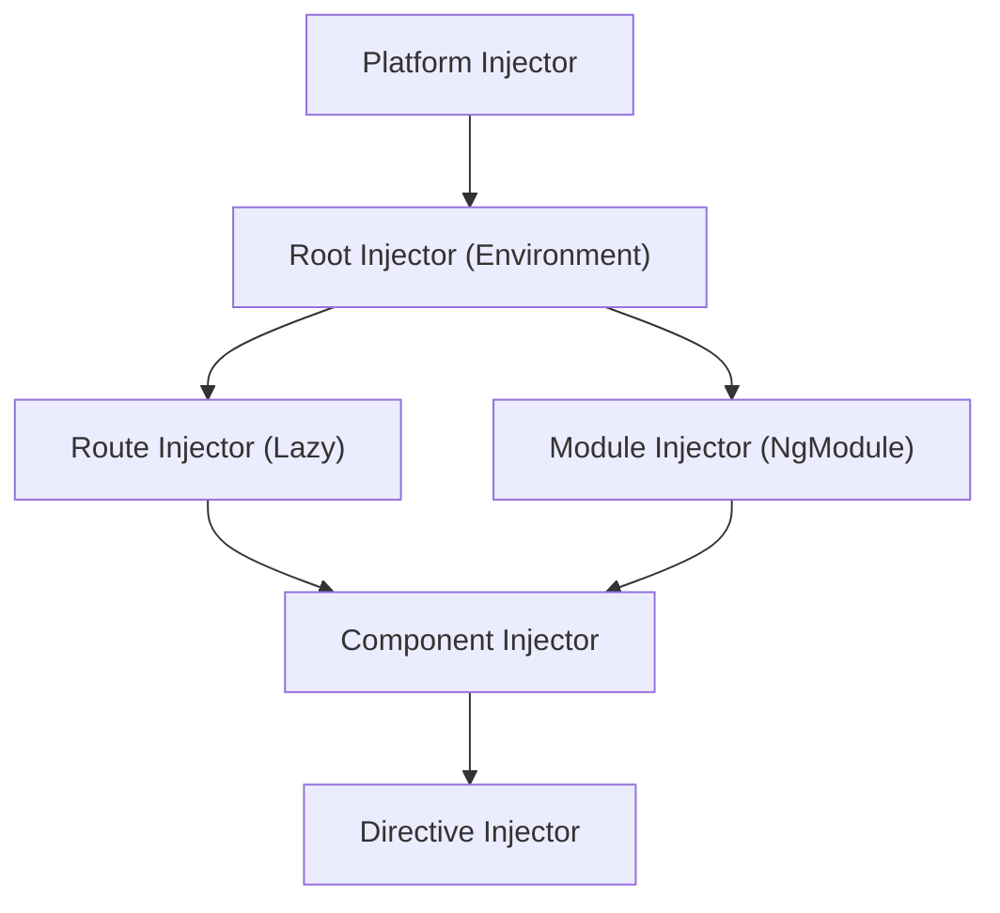

# Angular DI Hierarchy Demo App

## Architecture

The app uses a single `TrackerService` that is deliberately provided at different levels of the injector hierarchy. Each instance gets a unique ID, random color, counter (signal-based), and creation timestamp -- making it visually obvious when multiple instances exist.

A global `InstanceRegistryService` (provided only at root) records every `TrackerService` creation, powering a live "Instance Monitor" panel visible across the app.




## Tech Stack

- **Angular 21** (standalone components by default, NgModule only for the module-level demo)
- **Angular Material** for UI (sidenav, cards, tabs, toolbar, buttons)
- **Angular Signals** for reactive state in the tracker service

## Core Services

### `TrackerService` (the service provided at various levels)

- `instanceId`: short random UUID
- `color`: random pastel color (for visual distinction)
- `level`: string label indicating where it was provided
- `counter`: writable signal, increment/decrement
- `createdAt`: timestamp
- Registers itself with `InstanceRegistryService` on construction, unregisters on destroy

### `InstanceRegistryService` (`providedIn: 'root'`, singleton)

- Maintains a signal-based list of all live `TrackerService` instances
- Powers the floating "Instance Monitor" panel
- Proves visually that multiple instances coexist

## Shared Components

- `**InstanceCardComponent**` -- displays a single service instance (ID, color, counter, level badge, timestamps). Reused on every demo page.
- `**InstanceMonitorComponent**` -- floating/docked panel showing ALL live instances across the app in real time. Always visible.
- `**CodeSnippetComponent**` -- shows the relevant Angular code for each demo with syntax highlighting via `<pre><code>`.

## Pages / Routes


| Route            | Purpose                                                                                        |
| ---------------- | ---------------------------------------------------------------------------------------------- |
| `/`              | **Overview** -- interactive tree diagram of the 6 injector levels, links to each demo          |
| `/root`          | **Root Level** -- `providedIn: 'root'` singleton shared across sibling components              |
| `/component`     | **Component Level** -- `@Component({ providers: [...] })` each component gets its own instance |
| `/directive`     | **Directive Level** -- `@Directive({ providers: [...] })` applied via attribute directive      |
| `/route`         | **Route Level** -- route-level `providers` array, parent vs child routes                       |
| `/route/child-a` | Child route A (shares route-level instance)                                                    |
| `/route/child-b` | Child route B (shares route-level instance)                                                    |
| `/module`        | **Module Level** -- `NgModule` with providers, eager vs lazy-loaded comparison                 |
| `/platform`      | **Platform Level** -- providers passed to `bootstrapApplication` platform config               |
| `/pitfalls`      | **Common Pitfalls** -- 3 interactive scenarios showing real-world bugs                         |


## Pitfalls Scenarios (on `/pitfalls` page)

1. **"Why isn't my data shared?"** -- Two sibling components both provide `TrackerService` at the component level. User increments counter in one, expects the other to update -- it doesn't.
2. **"Accidental override"** -- Parent provides service at root, child re-provides at component level. Child silently gets a fresh instance, losing parent state.
3. **"Route navigation resets state"** -- Service provided at route level. Navigate away and back -- instance is destroyed and recreated, losing state.

## File Structure

```
src/
  main.ts                              # bootstrapApplication with platform-level provider
  app/
    app.component.ts                   # Shell: toolbar + sidenav + router-outlet + instance monitor
    app.config.ts                      # provideRouter, provideAnimations, importProvidersFrom
    app.routes.ts                      # All route definitions with route-level providers

    services/
      tracker.service.ts               # The DI demo service
      instance-registry.service.ts     # Global singleton tracking all instances

    shared/
      instance-card.component.ts       # Reusable instance display card
      instance-monitor.component.ts    # Floating panel of all live instances
      code-snippet.component.ts        # Code display component
      highlight.directive.ts           # Directive-level provider demo directive

    pages/
      overview/
        overview.component.ts          # Home page with tree diagram
      root-demo/
        root-demo.component.ts         # Root-level demo (parent + 2 children)
        root-child.component.ts        # Child consuming root-provided service
      component-demo/
        component-demo.component.ts    # Component-level demo with multiple instances
        isolated-counter.component.ts  # Component with its own provider
      directive-demo/
        directive-demo.component.ts    # Directive-level provider demo
      route-demo/
        route-demo.component.ts        # Route-level demo parent
        route-child-a.component.ts     # Route child A
        route-child-b.component.ts     # Route child B
      module-demo/
        module-demo.component.ts       # Module-level demo
        demo.module.ts                 # NgModule with providers
      platform-demo/
        platform-demo.component.ts     # Platform-level demo
      pitfalls/
        pitfalls.component.ts          # Tabbed pitfall scenarios
        shared-state-pitfall.component.ts
        override-pitfall.component.ts
        route-reset-pitfall.component.ts
```

## Key Implementation Details

- `**main.ts**`: Pass a platform-level `TrackerService` instance via `bootstrapApplication` providers, configured with `level: 'platform'`
- `**app.routes.ts**`: The `/route` path uses `providers: [TrackerService]` to create a route-scoped instance; `/module` lazy-loads an NgModule with its own provider
- **Each demo page**: Shows side-by-side the code snippet (how the service is provided) and the live result (instance cards with IDs and counters)
- **Instance Monitor**: Uses `InstanceRegistryService` to show a live count and list of all `TrackerService` instances, color-coded by level. This is the "aha" moment -- users see instances appearing/disappearing as they navigate.
- **Angular Material theme**: Use a custom theme with distinct colors for each DI level (root=blue, component=green, route=orange, directive=purple, module=teal, platform=red)

